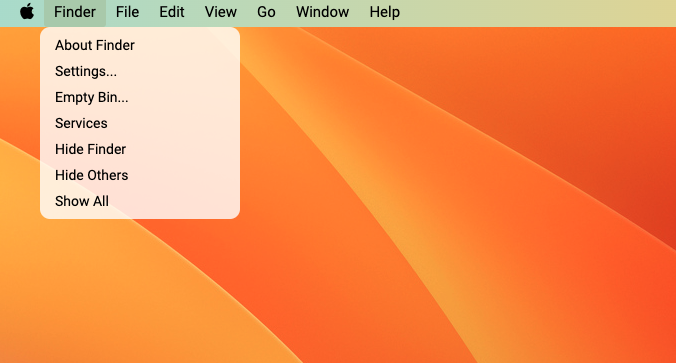

# FakeOS-Mac

This is a fake MacOS for desktop, it has a wallpaper, selectable icons and fake apps will be opened when clicking on some certain icon. The desktop looks exactly like the real MacOS.

### 🚀 [Launch Live Project](https://gulama2008.github.io/FakeOS-Mac/)

## Table of Contents

- [Snippets](#snippets)
- [Purpose](#purpose-of-project)
- [Tech Stack](#tech-stack)
- [Requirements](#requirements)
- [Features](#features)
- [Known Issues](#known-issues)
- [Future Goals](#future-goals)

## Snippets

Desktop  

Note app  

Photos app  

Finder app  

## Purpose Of Project
The goal of this project is to explore and consolidate my understandings of HTML, CSS and JavaScript. This project requires to replicate the layout and format of a design/image using CSS, add content via HTML and control the interactive elements via JavaScript

## Tech Stack
- HTML
- CSS/SCSS
- JavaScript

## Requirements
### HTML/SCSS
- Wallpaper scales to fit the viewport
- Minimum 3 icons on desktop
- The menu is positioned in the appropriate place (bottom left on windows, top of the screen on android)
- Apps look consistent
- Menu contains a flex with content inside it
- Apps should be able to contain text, an image or a form

### JavaScript
- Put your js code into separate files
- Your icons and menu should add event listener for the click event, don't use the html onclick attribute
- Give your functions and variables good names
- Use the arrow syntax to declare functions

## Feature
This FakeOS has the following features:
- The desktop itself has a wallpaper that fits the viewport
- There is a selectable menu bar on the top, and selecting the menu will display a list of submenu options

- There are some other icons on the top right corner, including battery, wifi, searching and date and time
- The date and time on the top right corner is displaying the current date and time

- There is a app bar at the bottom of the desktop, which is hided by default, and moving mouse to the bottom will make it shown (same as the Mac app bar)
- The app bar contains several app icons, among which Finder, Notes, Photos and Email is clickable, and the corresponding app will be opened

- When open the Finder app, a window will display which contains a side menu bar and the content section, the content section contains several folder icons in it

- When open the Photos app, a window will display which contains a side menu bar and the content section, the content section contains photos in it

- when open the Notes app, a notes window will display, the left side is the current notes already created, the right side is where showing the current note title and contents, or empty for creating new note

- The Notes app also has delete function shown as a bin icon, a save function shown as a disk icon and a create new note function shown as a pencil and paper icon on the top. When clicking on an existing note on the left side, clicking on the bin icon will delete it. When click the create new notes icon, the note title and content will be empty for creating new note, the background color for the active note on the left will also disappear. And when creating new note, clicking the save icon will save it to the left side notes list

## Known Issues  
 The Finder app and Photos app don't have actual functionalities right now

## Future Goals

- Add funtionality to Finder app, so that when clicking on a file/folder, a fake file/folder will be opened
- Add funtionality to Photos app, so that when clicking on photo icon, the photo will be opened and shown with a proper size
